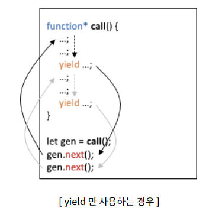

# Quest 03. 자바스크립트와 DOM

## Introduction
* 자바스크립트는 현재 웹 생태계의 근간인 프로그래밍 언어입니다. 이번 퀘스트에서는 자바스크립트의 기본적인 문법과, 자바스크립트를 통해 브라우저의 실제 DOM 노드를 조작하는 법에 대하여 알아볼 예정입니다.

## Topics
* 자바스크립트의 역사
  * 1995년 넷스케이프(Netscape)는 동적인 웹페이지를 만들기 위해서 브라우저에서 동작하는 가벼운 프로그래밍 언어를 만들기로 했다.
  넷스케이프의 브랜든 아이크가 스크립트 언어를 만들기 시작해 열흘만에 개발되었다.
  * 1996년 3월, 넷스케이프 네비게이터 2에 등장했고, 당시에는 그 언어의 첫번째 버전을 `Mocha`라고 불렀다.
  후에는 `LiveScript`로 바뀌었다가 결국에는 현재의 `JavaScript`가 되었다.
  * 같은 해 8월(1996년) MS가 자바스크립트의 파생 버전인 `JScript`를 `IE3.0`에 내놓았다.
  당시 브라우저 시장을 독점하다시피 했던 넷스케이프는 치고 올라오는 마이크로소프트의 IE를 견제할 필요가 있었다.
  넷스케이프와 MS는 각자의 시장점유율을 높이기 위해 자사 브라우저에서만 동작하는 기능을 추가한다.
  * 이로 인해 브라우저에 따라 웹페이지가 정상적으로 동작하지 않는 크로스 브라우징 이슈가 발생했다. 
  넷스케이프는 자바 스케이프는 자바스크립트의 표준화의 필요성을 깨닫고 *ECMA International에 자바스크립트 표준화를 요청한다.
    > (ECMA International) : 커뮤니케이션, 시스템, 정보 등 컴퓨터 시스템의 표준을 관리하는 비영리 표준화 기구
  * ECMAScript 등장은 1997년 7월 ECMA-262의 초판이 발행된다. ECMAScript를 통해 각 브라우저 제조사는 일관성 있는 가이드라인을 따라 자바스크립트 엔진을 구현할수 있게 되었다.
  이후 스펙이 계속 추가되어, 2015년 ES6에서는 `let/const`, `arrow function`, `class`, `module` 등 범용 프로그래밍 언어로서 갖춰야 할 기능을 대거 도입했다 ES6 이후부터는 매년 기능을 추가하여 발표하고 있다.  
  현재 IE나 구형 브라우저를 제외하고 대부분의 모던 브라우저는 ES6를 지원한다. 만약 IE까지 지원해야 하는 상황이라면 `BABEL`로 트랜스파일링을 해서 ES5 이하의 스펙으로 낮춰야 한다.
  반대로 ES6는 이전버전의 하위 호환성까지 고려했기 때문에 ES6를 지원하는 모던 브라우저에서는 ES5의 문법도 사용 가능하다.
  
  * Ajax  
  1999년, 자바스크립트를 이용해 필요한 데이터만 비동기적으로 로드할 수 있는 통신 기능인 Ajax(Asyncronous javascript and XML)이 XMLHttpRequest라는 이름으로 등장했다.
  
  * V8 자바스크립트 엔진  
  2008년, 구글이 크롬의 베타 버전과 함께 V8을 소개했다. 사용자가 웹에서 영상을 보고 게임을 하는 등 웹은 웹페이지 뿐만 아니라 `Application`으로서의 기능을 사용하게 되었다.  
  V8을 통해 웹브라우저 내에서 자바스크립트를 빠르게 수행할 수 있게 되면서 어플리케이션으로서 요구되는 성능을 갖추게 되었다.
  
  * Common Js  
  2009년 1월 1일, 모질라의 엔지니어 Kevin Dangoor는 브라우저 밖에서도 동작하는 범용 자바스크립트를 위해 표준화된 자바스크립트의 생태계가 필요하다고 했다. 그가만든 `serverjs` 프로젝트는 지금의 `commonJS`프로젝트가 되었고, `Node.js`나 대부분의 npm 패키지들은 commonJS의 스펙을 따르고 있다.
    
  
  * Node JS  
  라이언달 (Ryan Dahl)이 2009년 11월 JSConf에서 발표한 `Node.js`는 `Common.JS`의 스펙을 바탕으로 하고 V8엔진으로 빌드된 자바스크립트 런타임 환경이다. `Node.js`는 싱글 스레드 이벤트 루프를 기반으로 하지만 비동기 I/O로 논블로킹 작업이 진행된다.
  Node.js를 통해 범용 자바스크립트 패러다임은 현실이 되었다. 서버사이드의 `Node.js` 뿐만 아니라 현재 자바스크립트는 모바일 하이브리드 앱(Ionic, RN), 데스크톱(Eletron), 머신러닝(TensorFlow.js)등 여러 플래폼에서 사용할 수 있는 언어이다.
> 라이언 달은 9년 뒤 2018년애 `Node.JS`에 대한 후회와 함께 javascript, typeScript를 위한 새로운 런타임 환경 프로젝트인 deno를 발표한다.  
> 
  그 이후 모듈 로더, 번들러가 나오고 angular, react, vue가 나오고, typescript, rescript가 등장하는 드 자바스크립트는 계속해서 크고 작은 변화를 겪고 있다.
  * 기본 자바스크립트 문법

  * DOM API
    * `document` 객체
    * `document.getElementById()`, `document.querySelector()`, `document.querySelectorAll()` 함수들
    * 기타 DOM 조작을 위한 함수와 속성들
  * 변수의 스코프
    * `var`, `let`, `const`

## Resources
* [자바스크립트 첫걸음](https://developer.mozilla.org/ko/docs/Learn/JavaScript/First_steps)
* [자바스크립트 구성요소](https://developer.mozilla.org/ko/docs/Learn/JavaScript/Building_blocks)
* [Just JavaScript](https://justjavascript.com/)

## Checklist
* 자바스크립트는 버전별로 어떻게 변화하고 발전해 왔을까요?
  * 자바스크립트의 버전들을 가리키는 ES5, ES6, ES2016, ES2017 등은 무엇을 이야기할까요?
    * 우선 `ECMAScript`는 넷스케이프가 표준화를 위해 `JavaScript`를 ECMA  국제화기구에 제안한 결과로 `ECMAScript`라는 표준이 생겨났고 이것을 `ES`라고 한다.
    * `ES`에는 8개의 버전이 출시되었다.  
      1. ES1 : 1997년 6월~
      2. ES2 : 1998년 6월~
      3. ES3 : 1999년 12월~
      4. ES4 : 버려짐 (  정치적 차이들로)
      5. ES5 : 2009년 12월 : 거의 10년 후인 2009 년에 ES5가 공개된다. 
      6. ES6 /ES2015 : 2015 년 6월
      7. ES7 /ES2016 : 7번째 버전의 ECMAScript이다.
      8. ES8 /ES2017 : 8번째 버전의 ECMAScript이다.
        
    * 각 공개 버전들이 새로운 기능들을 언어에 가져온다.
    
  * 자바스크립트의 표준은 어떻게 제정될까요? 
  TC39 에 의해서 공개버전 발표된다.
    * 자바스크립트의 문법은 다른 언어들과 비교해 어떤 특징이 있을까요?
      1. 인터프리터 언어이다.
         - 기존에는 자바스크립트가 인터프리터 언어라는 특성으로 인해 느리다는 편견이 있었지만, 사용자의 컴퓨터 성능이 증가하고 브라우저내의 자바스크립트 엔진이 발전함에 따라 성능이 좋아졌다.
           > 인터프리터: 원시코드 명령어들을 한번에 한줄씩 읽어들여서 기계어로 변경하여 실행하는 프로그램이다. 일반적으로 프로그램을 컴파일하거나 통과시킨다.
      2. 동적 타입 언어이다.
      3. 함수 자체가 자료형이고 객체이다.
      4. 객체지향이면서도 함수 지향이다.
      5. 함수가 스코프를 정의한다.
      6. 브라우저를 조작할 수 있다.
         * 자바스크립트에서 반복문을 돌리는 방법은 어떤 것들이 있을까요?
           1. for: 고전적인 for문
              - `for(let i = 0 ; i< 10; i++){ 반복 수행코드 } `
              > 변수 선언시 const는 상수 값이므로 변경이 불가하여 에러가 발생.
           2. for in : 객체의 프로퍼티 키 열거전용
              - `for(const key in 객체){...반복 수행코드 ... }`
              > *주의* 해당 객체가 상속받는 프로토타입 체인상의 모든 프로퍼티 키를 열거한다.(단, [[Enumerable]] 값이 false인 프로퍼티 제외 ))
              ```javascript
              const obj = {
              name :'curryyou',
              job : 'enginner'
              }
              
              for (const key in obj){
              console.log(`${key} : ${obj[key]}`);
              }```
          
           3. for of : 이터러블 순회 전용
           `for(const item of 이터러블){...반복 수행코드...}`
           
           ```javascript
           const arr = [10,20,30];
           for (const item of arr){
            console.log(item);
           }
           ```
           4. forEach() : 배열 순회 전용 메서드
           `배열.forEach(function(value,index,array){...반복수행코드...})`
           * 콜백함수의 매개변수로 value에 요소값, index에 인덱스, array에 원본 배열이 들어있다.
           ```javascript
           [10,20,30].forEach((value, index, array)=>{
           console.log(`${index}: ${value}`);
           })
           ```
           5. while : 고전적인 while 문
           `while(조건식){... 반복 수행 코드 ... }`
           ```javascript
           let num = 0;
           while (num<3)
           {
           console.log(num);
           num++;
           }
           ```
           6. do while : 고전적인 do.. while 문
           `do{...반복 수행 코드...} while(조건식);`
           ```javascript
           do {
                console.log('일단 한번은 실행된다.');// 이 코드만 한번 실행되고 반복종료. 
           }while (false);
           ```
           7. object 객체 메서드 : 객체 순회 전용
              * Object.keys(객체)  
              :객체의 프로퍼티 '키'를 배열로 변환
              ```javascript
              Object.keys({name:'curryyou', job:'engineer'});
              // ['name', 'job']
              ```
              * Object.values(객체)  
              :객체의 프로퍼티 '값'을 배열로 반환
              ```javascript
              Object.value({name:'curryyou',job:'engineer'});
              // [  'curryyou','engineer']
              ```
               * Object.entries(객체)  
              :객체의 프로퍼티 [키,값]을 배열로 반환
              ```javascript
              Object.entries({name:'curryyou',job:'engineer'});
              // [ ['name', 'curryyou'],['job','engineer']]
              ```
           8. Array.prototype 메서드 : 배열전용
              * `배열.forEach((value, index,array)=>{...반복수행코드...})`  
           : 배열 의 length만큼 반복하여 콜백함수를 호출한다.  
           : 콜백함수의 매개변수로 value에 요소값, index에 인덱스, array에 원본배열이 들어온다.
              ```javascript
              [1,2,3,4].forEach((value, index,array)=>{
                console.log(value); // 1,2,3,4 출력
              })
              ```
              * 배열.map((vaile,index,array)=>{...반복 수행 코드...})
              : forEach와 동일(순회 방식,콜백 함수 매개변수 등)
              : 다른점 => 각 콜백함수에서 return하는 값들로 새로운 배열을 만들어 반환한다.
              ```javascript
              const map_result = [1,2,3,4].map((value, index, array)=> {
              console.log(value); //1,2,3,4 출력
              return value*10; //각 요소에 10을 곱한 값을 배열로 반환
              })
              
              console.log(map_result);
              //[ 10,20,30,40]
              ```
              * 배열.fillter((value,index,array)=>{...반복 수행 코드...})  
              : forEach와 동일(순회 방식, 콜백함수 매개변수 등)  
              : 다른점 => 각 콜백함수에서 return하는 값이 true일 때만, 그때의 value 값들로 새로운 배열을 만들어 반환한다.
              ```javascript
              const filter_result = [1,2,3,4].filter((value,index,array)=>{
              console.log(value); // 1,2,3,4 출력
              return value%2 == 0;})   // value가 짝수인 값들을 배열로 반환
              
              console.log(filter_result);
              // [2, 4]
              ```  
              
              * 배열.reduce((previousValue, currentValue, currendIndex, array)=> {...반복 수행코드...},initialValue)  
              : 두번째 매개변수인 `initalValue`값을 시작으로,  
              : 각 콜백함수가 return하는 값이 다음에 실행되는 콜백함수의 `previousValue`로 들어간다.  
              : 최종적으로 마짐가 콜백함수가 `return`하는 값을 반환한다.
              ```javascript
              const reduce_result = [1,2,3,4].reduce((pv,cv, idx,arr)=>{
              return pv + cv; //이전 콜백함수가 리턴한 값에 현재의 요소 값을 더함(누적 개념)
              }, 100); // 100을 초기값으로 줌.
              
              console.log(reduce_result);
              // 110(100 + 1+2+3+4 결과 )
              //배열에는 이 외에도 every(), some(), find(), findIndex() 등의 메서드가 존재한다.
              ```
              
         * 배열인 경우 : 배열.forEach() 사용

         * 객체인 경우 : Object.keys(객체) 사용

* 자바스크립트를 통해 DOM 객체에 CSS Class를 주거나 없애려면 어떻게 해야 하나요?
  - `document.Elemental.classList.add();`
  - `document.Elemental.classList.remove();`
  * IE9나 그 이전의 옛날 브라우저들에서는 어떻게 해야 하나요?
     - `className += '';`
* 자바스크립트의 변수가 유효한 범위는 어떻게 결정되나요?
  1. 블록 스코프
    블록 스코프는 중괄호로`{}` 로 감싸진 범위를 말한다.  
    ```javascript
    if(true){
    var variable1 = 'I am in a block';
    let variable2 = 'I am in a block';
    const variable3 = 'I am in a block';
    console.log(variable1); console.log(variable2); console.log(variable3);
    }
    for(var i=0; i<2; i++){
    var variable1 = 'I am in a block';
    let variable2 = 'I am in a block';
    const variable3 = 'I am in a block';
    console.log(variable1); console.log(variable2); console.log(variable3);
    }
    function func(){
    var variable1 = 'I am in a block';
    let variable2 = 'I am in a block';
    const variable3 = 'I am in a block';
    console.log(variable1); console.log(variable2); console.log(variable3);
    }
    ```
  2. 함수 스코프
    - 함수 스코프는 블록 스코 프 중 함수(function(){})범위를 갖는 스코프를 말합니다.
    ```javascript
    function func() {
          var variable1 = 'I am in a block';
          let variable2 = 'I am in a block';
          const variable3 = 'I am in a block';
          console.log(variable1); console.log(variable2); console.log(variable3);
    } // 특별히 차이가 보이지 않지만 함수 스코프 안에서 `var`로 선언된 변수는 C나 Java의 변수 선언,스코프에서 볼 수 없던 재밌는 현상을 만들어낸다.
    ```
  * `var`과 `let`으로 변수를 정의하는 방법들은 어떻게 다르게 동작하나요?  
  
    |변수구분|스코프|재선언|재할당|설명|
    |------|-----|-----|-----|----|
    |var   |전역  |  O  |  O  |함수 스코프 안에서 var로 작성된 선언문이 한번 실행되면 그 함수가 종료전까지 유효|
    |let   |지역  |  X  |  O  |지역함수의 성격을 띔으로써 블록 스코프에서 유효하다. |
    |Const |상수  |  X  |  X  | 선언과 동시에 초기화가 되어야하고 재할당 등이 불가한 상수|
* 자바스크립트의 익명 함수는 무엇인가요?  
  1.익명함수 이름이 없는 함수로 즉시 실행이 필요한 경우 사용하고, 재사용은 어렵다.
  * 자바스크립트의 Arrow function은 무엇일까요?
  1. `this`나 `super`에 대한 바인딩이 없고, `methods`로 사용될 수 없다.
  2. `new.target`키워드가 없다.
  일반적으로 스코프를 지정할 때 사용하는 `call`,`apply`,`bind` methods를 사용할 수 없다.
  3. 생성자로 사용할 수 없다.
  4. `yield`를 화살표 함수 내부에서 사용할 수 없다.
  >  `yield`키워드는 제너레이터 함수 (`function* `또는 `레거시 generator` 함수)를 중지하거나 재개하는데 사용한다.
  > `[rv] = yield[expression];`
  > `expression` 제네레이터 함수에서 제네레이터 프로콜을 통해 반환할 값을 정의한다. 값이 생략되면 `undefined`를 반환한다.
  > `rv` 제네레이터 실행을 재개하기 위해서, optional value을 제너레이터의 `next()` 메서드로 전달하여 반환한다.
  > `yield` 키워드는 제너레이터 함수의 실행을 중지시키거나 그리고 `yield`키워드 뒤에 오는 표현식[expression]의 값은 제너레이터의 caller로 반환된다.
  > `yield` 는 자바스크립트의 비동기 처리를 위해 만들어진 것으로, 개발을 할 때 자주 사용하게 되는 함수이다.
  > 
  > function*으로 함수를 정의하고, 이 함수 내에 포함되어 있는 property 중에 next()를 차례로 호출함으로써, 함수 내에 코딩해둔 `yield`를 차례로 실행시키는 것이고, 아래 3가지 키워드를 사용해서 코드가 만들어진다.  
  > funciton* : function 뒤에 astrok(*)를 붙이면, 이를 `generatior function`이라고 불리는 함수형태가 된다. 이 함수는 비동기처리를 할 수 있는 함수로서 내부에서 `yield`라는 키워드를 사용해서 코딩을 하면, 해당 라인까지만 코드를 실행하고 뒷부분은 다시 실행을 요청할 때까지 실행하지 않게함으로써 마치 함수가 실행 중에 특정 부분에서 일시 정지된 것처럼 동작함으로써, 비동기 처리를 하도록 만들 수가 있다.  
  > yield : `generator function` 안에 `yield` 키워드를 사용한 곳들을 기준으로 코드가 잘려서 실행하게 된다고 볼 수 있다.  
  > 만약에, `yield`문을 만날때까지 특정 처리를 수행했다면, 함수는 잠깐 잘린 상태로 정지해있다가 다시 이 함수로 접근했을 때(`next` 함수를 호출했을때)멈췄던 부분부터 실행을 이어서 하고 다음 `yield`문을 만날때까지 쭈욱 실행이 되는 것이다.  
  > 이러한 구조로 인해 `yield`를 기준으로 처리가 나눠진 곳들을 실행시키는 명령을 외부로 넘기는 형태가 만들어지게 되는 것이다. 따라서, `generator`의 `next`함수를 실행하면 `{value, done}`이라는 데이터를 반환한다.   
  > 참고로 `next()`를 실행하는 이유는 `generator`는 반복구조인 `iterator`를 사용하는 구조이기 때문이다.  
  > 아래는 `yield`를 사용해서 비동기 처리를 하는 `call()`이라는 함수를 만들어보았다.  참고로, 함수를 호출할 때는 `next()`를 사용해도 되지만, 배열을 반복하는 `for..of`문법을 사용해서 `call()`함수 내에 있는 `yield`를 차례로 호출시킬 수도 있다.

## Quest
* (Quest 03-1) 초보 프로그래머의 영원한 친구, 별찍기 프로그램입니다.
  * [이 그림](jsStars.png)과 같이, 입력한 숫자만큼 삼각형 모양으로 콘솔에 별을 그리는 퀘스트 입니다.
    * 줄 수를 입력받고 그 줄 수만큼 별을 그리면 됩니다. 위의 그림은 5를 입력받았을 때의 결과입니다.
  * `if`와 `for`와 `function`을 다양하게 써서 프로그래밍 하면 더 좋은 코드가 나올 수 있을까요?
  ```javascript
    
    let a = Number(prompt());
    let b = "*";
    let c = "";
    for(var i = 0; i < a; i++) {
            c += b;
           console.log(c);
       // for(var y = 0; y < i; y++) {
       // 
       //    c += b;
       //    console.log(c);
       //  }    
       
        
    }
    //*
    //**
    //***
    //****
  ```
  ```javascript
  let inputParam = Number(prompt());//5
  let star = "*";
  let blank = "#";
  let result = "";
  
  for(var i = 0; i < inputParam; i++) { 
       
        for(var y = inputParam-i; y > 0; y--) {
          result += blank;
        }
         for(var z = 0; z <2*i+1; z++) {
           result += star;
        }
          console.log(result);
          result = "";
        
    }
  //     *
  //    ***
  //   *****
  //  *******
  //////////////////////////////////
  /*
    let inputParam = Number(prompt());//5
    let star = "*";
    let blank = "#";
    let starResult = "";
    let blankResult ="";
    let minus = Number(1);
    let plus  = Number(1);
    
    for(var i = 0; i <= inputParam; i++) { 
        blankResult += blank;
        starResult += star;  
        console.log(blankResult+starResult);
        
    }
  */

  ```
  * 입력은 `prompt()` 함수를 통해 받을 수 있습니다.
  * 출력은 `console.log()` 함수를 통해 할 수 있습니다.
* (Quest 03-2) skeleton 디렉토리에 주어진 HTML을 조작하는 스크립트를 완성해 보세요.
  * 첫째 줄에 있는 사각형의 박스들을 클릭할 때마다 배경색이 노란색↔흰색으로 토글되어야 합니다.
  * 둘째 줄에 있는 사각형의 박스들을 클릭할 때마다 `enabled`라는 이름의 CSS Class가 클릭된 DOM 노드에 추가되거나 제거되어야 합니다.
* 구현에는 여러 가지 방법이 있으나, 다른 곳은 건드리지 않고 TODO 부분만 고치는 방향으로 하시는 것을 권장해 드립니다.

## Advanced
* Quest 03-1의 코드를 더 구조화하고, 중복을 제거하고, 각각의 코드 블록이 한 가지 일을 전문적으로 잘하게 하려면 어떻게 해야 할까요?
    - for문과 if문을 줄이고 최대한 연산을 사용한다.
* Quest 03-2의 스켈레톤 코드에서 `let` 대신 `var`로 바뀐다면 어떤 식으로 구현할 수 있을까요?
    - `var`로 변경하면 `node` 등의 이름이 동일한 변수들이 스코프가 겹쳐지기 때문에 변수명을 변경해주거나 해야한다.