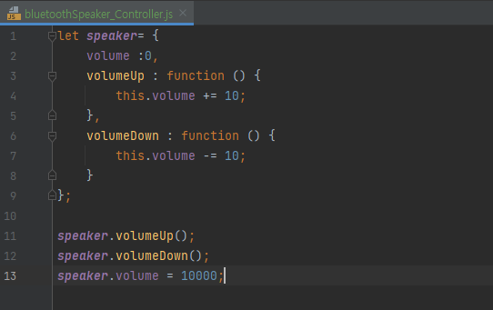
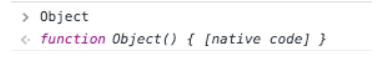
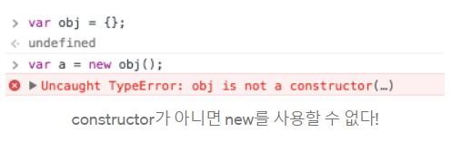
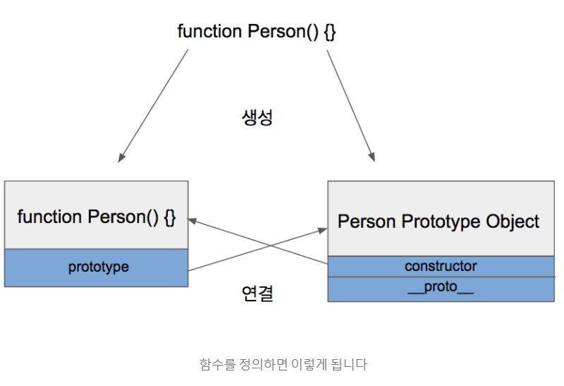
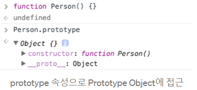
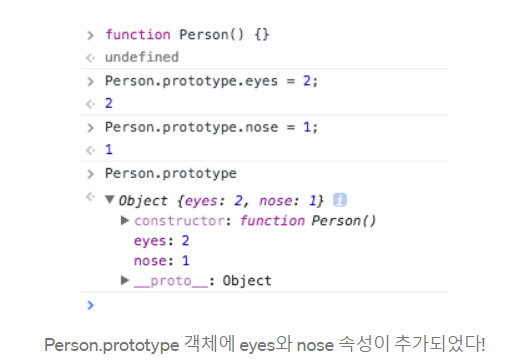
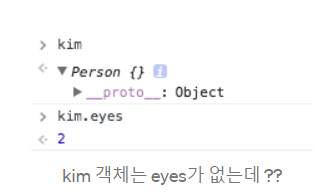
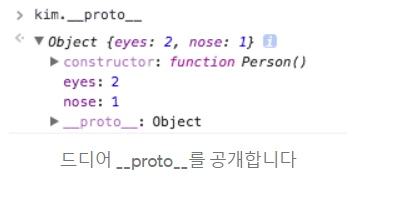
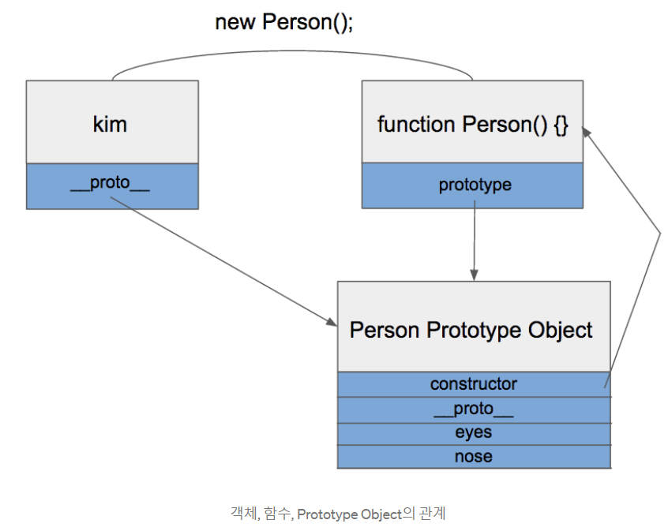

# Quest 04. OOP의 기본

## Introduction
* 이번 퀘스트에서는 바닐라 자바스크립트의 객체지향 프로그래밍에 대해 알아볼 예정입니다.

## Topics
* 객체지향 프로그래밍
  - (Object Oriented Programming)
  객체 지향 프로그래밍이란 어떤 동작이나 로직보다는 객체를 중심을 프로그래밍을 하는 일종의 새로운 패러다임이다.  
  여기서 객체란 우리가 모델링하고자 하는 대상과 관련돈 모든 정보와 데이터, 코드, 동작, 기능들을 담을 수 있다. 그러니까 객체지향 프로그래밍이란 간단하게 말해서 우리가 어떤 프로그램을 새로 만들려고 할 때 어떤 방식으로 프로그램을 구성하고 조립할 것인지에 대한 이론적인 개념이다 . 어떤 식으로 프로그램을 만드느냐는 순전히 개발자의 창의력과 아이디어에 달려있다. 그러니까 우리가 객체지향 프로그매잉에서 주로 사용되는 프로토타입이나 클래스 등이 어떤 식으로 가능하는지는 공부할 수 있지만 객체지향 프로그래밍 자체를 어떻게 하는지는 순전히 개인의 상상력에 달린 문제이다.
-   
위와 같이 사용자는 speaker.volumeUp()와 speaker.volumeDown() 함수를 호출하여 원하는만큼 볼륨을 조절할 수 있다.  
그런데 문제는 외부에서 speaker.volume에 직접 접근하여 값을 변경할 수 있다는 점이다. 이렇게 되면 볼륨의 최대 허용 크기가 100인데, 의도치 않게 10000이란 값을 부여하여 오류를 발생 시킬 수 있다. 이러한 문제를 방지 하기 위해 volume 변수를 외부에서 변경할 수 없도록 보호하는 것을 캡슐화라고 한다.
  * 프로토타입 기반 객체지향 프로그래밍
    - 프로토타입 기반 프로그래밍은 객체지향 프로그래밍의 한 형태의 갈래로 클래스가 없고, 클래스 기반 언어에서 상속을 사용하는 것과 다르게, 객체를 원형(프로토타입)으로 하여 복제의 과정을 통하여 객체의 동작방식을 다시 사용할 수 있다. 프로토타입기반 프로그래밍은 클래스리스, 프로토타입 지향, 혹은 인스턴스 기반 프로그래밍이라고도 한다,
    - 프로토 타입 기반 언어의 가장 원조격인 프로그래밍 언어인 셀프는 데이비드 엉거와 랜덜 스매스가 개발했다. 클래스리스 프로그래밍은 최근에 와서 많이 유명해졌는데, 자바스크립트와 모픽 프레임 워크를 사용하는 스퀵에 적용되었고, 그 외에 세실, 뉴튼스크립트, 아이오, 무, 리볼, 케보 등에 적용되었다.
      - ##### 클래스 기반과의 비교
        - 클래스기반 언어에서 객체는 일반적으로 두 가지 형태가 있다. '클래스'는 객체의 기본적인 만듦새와 기능을 정의하고, '인스턴스'는 "사용할 수 있는" 객체로 특정 클래스의 양식을 기반으로 한다. 클래스 기반 언어에서 '클래스'는 동작 방식인 메소드의 모임으로 동작하고, 모든 인스턴스의 구조는 동일하고, 인스턴스는 객체의 자료를 가지고 있다. 한쪽에는 구조와 동작방식, 다른 한쪽에는 상태로 구분된다.
        - 프로토타입기반 프로그래밍을 지지하는 사람들은 클래스기반 언어에서는 개발자가 클래스들 사이의 분류와 관계에 먼저 초점을 맞추기 쉽다고 한다. 이와는 달리, 프로토타입기반 프로그래밍은 프로그래머가 여러 가지 표본의 동작 방식에 초점을 맞추고, 이 객체들은 나중에 클래스와 비슷한 방식의 "객체의 원형"으로 분류하는 것은 나중에 걱정해도 된다. 많은 프로토타입기반 체계가 실행시간에 프로토타입을 대체하기 쉬우나, 클래스기반 객체지향 체계에서는 최초의 동적 객체지향 체계인 스몰토크와 같이 프로그람의 실행중에 클래스를 바꿀 수 있는 것은 몇 가지도 되지 않는다. 
        - 프로토타입 기반 프로그래밍은 학습의 과정의 주요한 특징으로 프로토타입이나 `이그젬플러`를 강조하는 '인지 심리학'과 같은 특정 심리학과 관련되어 있는 경우가 많다.
          - 프로토타입 기반 체계의 대부분은 인터프리터이고 동적 타입 프로그래밍 언어이다. 하지만 프로토타입기반의 정적 타입의 체계가 기술적으로 가능하다. 오메가는 그런 체계의 한 예이다.
            -  프로토타입?
               자바스크립트는 프로토타입 기반이 언어라고 불린다. 자바스크립트 개발을 하면 빠질 수 없는 것이 프로토타입인데, 프로토타입이 거의 자바스크립트 자체이기 때문에 이해하는 것이 어렵고 개념이 복잡하다고 한다.
              하지만 프로토타입이 무엇인지 아는 순간 자바스크립트의 숙련도가 올라간다고들 하니 알아보자.
              ProtoType vs Class
              클래스(Class)라는 것을 한번쯤은 들어봤을 것이다. Java, Python, Ruby 등 객체지향 언어에서 빠질 수 없는 개념이다.
              그런데 중요한 점은 자바스크립트도 객체지향언어라는 것이다. 이게 왜 중요하냐 ? 자바스크립트에는  클래스라는 개념이 없다. 대신 프로토타입(Prototype)이라는 것이 존재한다. 
              자바스크립트가 프로토타입 기반 언어라고 불리는 이유이다.
              클래스가 없으니 기본적으로 상속기능도 없다, 그래서 보통 프로토타입을 기반으로 상속을 흉내내도록 구현하여 사용한다.
              ECMA6 표준에서부터 Class문법이 추가되었다고 하는데, 문법이 추가되었다는 것이지, 자바스크립트가 클래스기반으로 바뀌었다는 것은 아니다.
              프로토타입을 언제 사용하냐? 하면
              자바 스크립트에 클래스는 없지만 함수(Function)와 new 를 통해 클래스를 비스무리하게 흉내낼 수 있다 .
              ```javascript
                  function person(){
                  this.eyes = 2;
                  this.nose = 1;
                  }
                let kim = new Person();
                let park = new Person();
            
              console.log(kim.eyes); //=> 2
              console.log(kim.nose); //=> 1
            
              console.log(park.eyes); //=> 2
              console.log(park.nose); //=> 1
               ```
            kim과 park은 eye와 nose를 공통적으로 가지고 있는데, 메모리에는 eyes와nose가 두 개씩 총 4개 할당된다. 객체를 100개 만들면 200개의 변수가 메모리에 할당된다. 
            이러한 문제를 프로토타입으로 해결할 수 있다.
            ```javascript
            function Person() {}
            Person.prototype.eyes = 2;
            Person.prototype.nose = 1;
            
            let kim = new Person();
            let Park = new Person();
            
            console.log(kim.eyes); // => 2
            ```
            자바스크립트 개발을 하는 사람이라면 최소한 본적은 있을 것이다.
            간단하게 설명하면 `Person.prototype`이라는 빈 Object가 어딘가에 존재하고 `Person`함수로부터 생성된 객체`kim,park`들은 어딘가에 존재하는 `Object`에 들어있는 값을 모두 갖다쓸 수 있습니다.
            즉, `eyes`와 `nose`를 어딘가에 있는 빈 공간에 넣어놓고 `kim` 과 `park`이 공유해서 사용하는 것이다.
        - prototype Link와 Prototype Object  
        자바스크립트에는 `Prototype Link` 와 `Prototype Object`라는 것이 존재한다.
        그리고 이둘을 통틀어 `prototype`이라고 부른다. 프로토타입을 좀 안다는 것은 이 둘을 완벽히 이해하고 갖고 놀 수준이 되었다는 뜻이다.
        - Prototype Object  
        객체는 언제나 함수(Function)로 생성된다.
        ```javascript
         function Person() {} // => 함수
         let personObject = new Person(); //=> 함수로 객체를 생성
        ```
        - `personObject` 객체는 `Person` 이라는 함수로 생성된 객체이다. 이렇듯 언제나 객체는 함수에서 시작된다. 여러분이 많이 쓰는 일반적인 객체 생성도 예외는 아니다.  
        ```javascript
        let obj = {};
        ```  
        얼핏보면 함수랑 전혀 상관없는 코드로 보이지만 위 코드는 사실 다음 코드와 같습니다.  
        ```javascript
        let obj = new Object();
        ```  
        위 코드에서 `Object`가 자바스크립트에서 기본적으로 제공하는 함수이다. 
      - 
      - `Object`와 마찬가지로 `Function`,`Array`도 모두 함수로 정의되어 있습니다. 이것이 첫 번째 포인트이다.
      - 그렇다면 이것이 `Prototype Object`랑 무슨 상관이 있느냐? 함수가 정의될 때는 2가지 일이 동시에 이루어진다.
        1. 해당 함수에 `Constructor`(생성자) 자격 부여
           - `Constructor` 자격이 부여된다면 `new`를 통해 객체를 만들어 낼 수 있게 된다. 이것이 함수만 `new` 키워드를 사용할 수 있는 이유이다.
           - 
        2. 해당 함수의 `Prototype Object` 생성 및 연결
           - 함수를 정의하면 함수만 생성되는 것이 아니라 `Prototype Object`도 같이 생성이 된다.
           - 
           - 그리고 생성됨 함수는 `prototype`이라는 속성을 통해 `Prototype Object`에 접근할 수 있습니다. `Prototype Object`는 일반적인 객체와 같으며 기본적인 속성으로 `constructor`와 `__proto__`를 가지고 있다.
           - 
           - `constructor`는 `Prototype Object`와 같이 생성되었던 함수를 가리키고 있다.
           - `__proto__`는 `Prototype Link`이다. 밑에서 자세히 설명한다.
           - 위에서의 `kim`과 `park`이 나왔던 예제를 다시 보면.
           ```javascript
                function Person() {}
                
                Person.prototype.eyes = 2;
                Person.prototype.nose = 1;
           
                let kim = new Person();
                let park = new Person();
                
                console.log(kim.eyes); // => 2
           ```
           - 
           - `Prototype Object`는 일반적인 객체이므로 속성을 마음대로 추가/삭제 할 수 있다.
           - `kim`과 `park`는 `Person` 함수를 통해 생성되었으니  `Person.prototype`을 참조할 수 있게 된다.
           
        3. `Prototype Link`
          - 
          - `kim`에는 `eyes` 라는 속성이 없는데도 `kim.eyes`를 실행하는 2라는 값을 참조하는 것을 볼 수 있다.
          - 위에서 설명했듯이 `Prototype Object`에 존재하는`eye`속성을 참조한 것인데요.
          - 바로 `kim`이 가지고 있는 딱 하나의 속성 `__proto__`가 그것을 가능하게 해주는 열쇠 입니다.
          - `prototype` 속성은 함수만 가지고 있던 것과는 달리 `Person.prototype` 속성은 모든 객체가 빠짐없이 가지고 있는 속성입니다.
          - `__proto__` 속성은 모든 객체가 빠짐없이 가지고 있는 속성이다.
          - `__proto__` 는 객체가 생성될 때 조상이었던 함수의 `Prototype Object`를 가리킨다.
          - `kim` 객체는 `Person` 함수로부터 생성되었으니 `Person` 함수의 `Prototype Object` 를 가리키고 있는 것이죠.
          - 
          - `__proto__`를 까보니 역시 `Person` 함수의 `Prototype Object`를 가리키고 있었다.
          - 
          - `kim` 객체가 `eyes`를 직접 가지고 있지 않기 때문에 `eyes` 속성을 찾을 때까지 상위 프로토타입을 탐색한다. 최상위인 `Object`의 `Prototype Object`까지 도달했는데도 못찾을 경우 `undefined`를 리턴한다. 이렇게 `__proto__`속성을 통해 상위 프로토타입과 연결되어 있는 형태를 __프로토타입 체인__ 이라고 한다 .
  * 자바스크립트 클래스
    * 생성자
    * 멤버 함수
    * 멤버 변수
  * 정보의 은폐
  * 다형성
* 코드의 재사용

## Resources
* [MDN - Classes](https://developer.mozilla.org/ko/docs/Web/JavaScript/Reference/Classes)
* [MDN - Inheritance and the prototype chain](https://developer.mozilla.org/ko/docs/Web/JavaScript/Inheritance_and_the_prototype_chain)
* [MDN - Inheritance](https://developer.mozilla.org/ko/docs/Learn/JavaScript/Objects/Inheritance)
* [Polymorphism](https://medium.com/@viktor.kukurba/object-oriented-programming-in-javascript-3-polymorphism-fb564c9f1ce8)
* [Class Composition](https://alligator.io/js/class-composition/)
* [Inheritance vs Composition](https://woowacourse.github.io/javable/post/2020-05-18-inheritance-vs-composition/)

## Checklist
* 객체지향 프로그래밍은 무엇일까요?
  * `#`로 시작하는 프라이빗 필드는 왜 필요한 것일까요? 정보를 은폐(encapsulation)하면 어떤 장점이 있을까요?
  * 다형성이란 무엇인가요? 다형성은 어떻게 코드 구조의 정리를 도와주나요?
  * 상속이란 무엇인가요? 상속을 할 때의 장점과 단점은 무엇인가요?
  * OOP의 합성(Composition)이란 무엇인가요? 합성이 상속에 비해 가지는 장점은 무엇일까요?
* 자바스크립트의 클래스는 어떻게 정의할까요?
  * 프로토타입 기반의 객체지향 프로그래밍은 무엇일까요?
  * 자바스크립트의 클래스는 이전의 프로토타입 기반의 객체지향 구현과 어떤 관계를 가지고 있나요?
  * 

## Quest
* 웹 상에서 동작하는 간단한 바탕화면 시스템을 만들 예정입니다.
* 요구사항은 다음과 같습니다:
  * 아이콘은 폴더와 일반 아이콘, 두 가지의 종류가 있습니다. 
    * 아이콘은 고유식별값과 x좌표값, y좌표값을 가진다.
  * 아이콘들을 드래그를 통해 움직일 수 있어야 합니다.
    * 아이콘을 드래그했을 때 다음 과정을 실행한다.
      * 해당 아이콘의 좌표는 이동한 위치의 좌표로 갱신.
      * 기존에 렌더링된 아이콘들을 x값과 y값을
  * 폴더 아이콘은 더블클릭하면 해당 폴더가 창으로 열리며, 열린 폴더의 창 역시 드래그를 통해 움직일 수 있어야 합니다.
  * 바탕화면의 생성자를 통해 처음에 생겨날 아이콘과 폴더의 개수를 받을 수 있습니다.
  * # 여러 개의 바탕화면을 각각 다른 DOM 엘리먼트에서 동시에 운영할 수 있습니다.
  * Drag & Drop API를 사용하지 말고, 실제 마우스 이벤트(mouseover, mousedown, mouseout 등)를 사용하여 구현해 보세요!

  * 


## Advanced
* 객체지향의 역사는 어떻게 될까요?
* Smalltalk, Java, Go, Kotlin 등의 언어들로 넘어오면서 객체지향 패러다임 측면에서 어떤 발전이 있었을까요?
