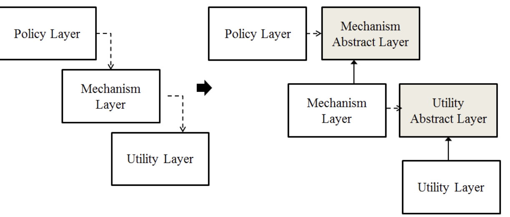

# Quest 05. OOP 특훈

## Introduction
* 이번 퀘스트에서는 바닐라 자바스크립트의 객체지향 프로그래밍을 조금 더 훈련해 보겠습니다.

## Topics
* Separation of Concerns
  * 관심사 분리 (Separation of Concerns, ___SoC___ )는 컴퓨터 프로그램을 구별된 부분으로 분리시키는 디자인 원칙이다.  각 부문은 개개의 관심사를 해결한다.
  * 관심사란 컴퓨터 프로그램 코드에 영향을 미치는 정보의 집합이다.    
    
  관심사는 
  * 코드 최적화가 필요한 하드웨어의 세세한 부분만큼 포괄적일 수 있다.
  * 혹은 시작할 클래스의 이름처럼 구체적일 수 있다.
  * SoC를 구현하는 프로그램은 `모듈러`프로그램이라고 부른다.
    * 모듈식, 즉 관심사의 분리는 정보를 잘 정의된 인터페이스가 있는 코드 부분 안에 ___캡슐화___ 시킴으로써 달성한다. 
    * 캡슐화는 정보 숨기기의 한 수단이다.
    * 정보 시스템의 계층화된 디자인은 관심사 분리의 다른 구현이다. (ex: 표현 계층, 비즈니스 로직 계층, 데이터 접근 계층, 퍼시스턴스 계층)
    * 관심 사 분리를 이용하면 프로그램의 설계, 디플로이, 이용의 일부 관점에 더 높은 정도의 자유가 생긴다. 이 가운데 일반적인 걱은 코드의 단순화 및 유지보수의 더 높은 수준의 자유이다. 
    * 관심사가 잘 분리될 때 독립적인 개발과 업그레이드 외에도 모듈 재사용을 위한 더 높은 정도의 자유가 있다.
    * 모듈이 인터페이스 뒤에서 이러한 관심사의 세세한 부분을 숨기기 때문에 자유도가 높아짐으로써 다른 부분의 세세한 사항을 모르더라도, 또 해당 부분들에 상응하는 변경을 취하지 않더라도 하나의 관심사의 코드 부분을 개선하거나 수정할 수 있께 된다.
    * 모듈은 각기 다른 버전의 인터페이스를 노출할 수 있으며, 이를 통해 중간의 기능 손실 없이 단편적인 방식으로 복잡한 시스템을 업그레이드 하는 자유도를 높여준다.
    * 관심사 분리는 추상화의 일종이다. 대부분의 추상화에서처럼 ___인터페이스___ 의 추가는 필수이며 실행에 쓰이는 더 순수한 코드가 있는 것이 일반적이다. 그러므로 잘 분리된 관심사의 여러 장점에도 불구하고 관련 실행에 따른 불이익이 있다.
* 객체지향의 설계 원칙
  * SOLID 원칙
    1. SRP (단일 책임의 원칙 : Single Responsibility Principle)  
      - 작성된 클래스는 하나의 기능만을 가지며 클래스가 제공하는 모든 서비스는 그 하나의 책임을 수행하는 데 집중되어 있어야 한다는 원칙이다.
      - 이는 어떤 변화에 의해 클래스를 변경해야 하는 이유는 오직 하나뿐이어야함을 의미합니다.
      - SRP를 적용하면 무엇보다 책임 영역이 확실해지기 때문에 한 책임의 변경에서 다른 책임의 변경으로의 연쇄작용에서 자유로울 수 있다.
      - 리팩토링에서 소개하는 대부분의 위험상황에 대한 해결방법은 직/간접적으로 SRP원리와 관련이 있으며, 이는 항상 코드를 최상으로 유지한다는 리팩토링의 근본정신도 항상 객체들의 책임을 최상의 상태로 분배한다는 것에서 비롯되기 때문이다.
    2. OCP (개방 폐쇄의 원칙 : Open Close Principle)
      - 버틀란트 메이어 박사가 1998년 객체지향 소프트웨어 설계라는 책에서 정의한 내용으로 소프트웨어의 구성요소(컴포넌트, 클래스, 모듈, 함수)는 확장에는 열려있고, 변경에는 닫혀있어야 한다는 원리입니다.
      - 변경을 위한 비용은 줄이고 확장을 위한 비용은 가능한 극대화 해야 한다는 의미로, 요구사항의 변경이나 추가사항이 발생하더라도, 기존 구성요소는 수정이 일어나지 말아야 하며, 기존 구성요소를 쉽게 확장해서 재사용할 수 있어야 한다는 뜻이다. 
      - 로버트 C 마틴은 OCP는 관리가능하고 재사용 가능한 코드를 만드는 기반이며, OCP를 가능하게 하는 중요 메커니즘은 추상화와 다형성이라고 설명하고 있다. 
      - OCP는 객체지향의 장점을 극대화하는 아주 중요한 원리이다.
      - 변경될 것과 변하지 않을 것을 엄격히 구분한다.
      - 이 두 모듈이 만나는 지점에 인터페이스를 정의한다.
      - 구현에 의존하기보다 정의한 인터페이스에 의존하도록 코드를 작성한다.
    3. LSP (리스코브 치환의 원칙 : The Liskov Substitution Principle)
      - FUNCTIONS THAT USE POINTERS OR REFERENCES TO BASE CLASSES MUST BE ABLE TO USE OBJECTS OF DERIVED CLASSES WITHOUT KNOWING IT.
      - 이 원칙은 좀처럼 쉽게 이해되지 않는 원칙으로 LSP라는 이름에서는 도저히 원칙에 대한 내용을 도출할 수 없는 원칙이다. LSP는 "서브타입은 언제나 기반 타입으로 교체 할 수 있어야한다."  
        서브 타입은 언제나 기반 타입과 호환될 수 있어야 한다. 달리 말하면 서브 타입은 기반 타입이 약속한 규약을 지켜야 한다. 상속은 구현상속 (extends 관계)이든 인터페이스 상속(implements 관계)이든 궁극적으로는 다형성을 통한 확장성 획득을 목표로 한다.  
      - LSP 원리도 역시 서브 클래스가 확장에 대한 인터페이스를 준수해야 함을 의미한다.
      - 다형성과 확장성을 극대화 하려면 하위 클래스를 사용하는 것보다 상위의 클래스를 사용하는 것이 좋다.
      - 일반적으로 선언은 기반 클래스로 생성은 구현체 클래스로 대입하는 방법을 사용한다.
      - 생성 시점에서 구현체 클래스를 노출시키기 꺼려질 경우 생성 부분을 Abstract Factory 등의 패턴을 사용하여 유연성을 높일 수 있다.
      - 상속을 통한 재사용은 기반 클래스와 서브 클래스 사이에 IS-A 관계 가 있을 경우로만 제한되어야 한다.
      - 그 외의 경우에는 합성(composition)을 이용한 재사용을 해야 한다.
      - 상속은 다형성과 따로 생각할 수 없다. 그리고 다형성으로 인한 확장 효과를 얻기 위해서는 서브 클래스가 기반 클래스와 클라이언트 간의 규약(인터페이스)를 어겨서는 안된다.
      - 이 구조는 다형성을 통한 확장의 원리인 OCP를 제공하게 된다.
      - LSP는 OCP를 구성하는 구조가 된다.
      - LSP는 규약을 준수하는 상속구조를 제공 한다. LSP를 바탕으로 OCP는 확장하는 부분에 다형성을 제공해 열려있는 프로그램을 만들 수 있도록 한다.
      - 만약 두 개체가 똑같은 일을 한다면 둘을 하나의 클래스로 표현하고 이들을 구분할 수 있는 필드를 둔다.
      - 똑같은 연산을 제공하지만, 이들을 약간씩 다르게 한다면 공통의 인터페이스를 만들고 둘이 이를 구현 합니다.(인터페이스 상속)
      - 공통된 연산이 없다면 완전 별개인 2개의 클래스를 만든다.
      - 만약 두 개체가 하는 일에 추가적으로 무언가를 더 한다면 구현 상속을 사용한다.
  ```javascript
  void f (){
    LinkedList list = new LinkedList();
     //...
     modify(list);
  }
  void modify(LinkedList list){
    list.add(...);
  doSomthingWith(list);
  }
  ```
     - 위 코드에서 `List`만 사용할 것이라면 이 코드도 문제는 없다. 하지만 만약 속도 개선을 위해 `HashSet`을 사용해야 하는 경우가 발생한다면 `LinkedList` 를 다시 `HashSet`으로 어떻게 바꿀 수 있을까, `LinkedList`와 `HashSet`은 모두 `Collection` 인터페이스를 상속하고 있으므로 다음과 같이 작성하는 것이 바람직하다.
     - ```javascript
        void f(){
       Collection colleciton = new HashSet();
       //...
       modify(colleciton);
       }
       
       void modify(Collection colleciton){
        colleciton.add(..);
        doSomethingWith(colleciton);
       }
       ```
     - 이와 같은 경우 이제 컬렉션 생성 부문만 고치게면 어떤 컬렉션 구현 클래스든 사용할 수 있다. 이 프로그램에서 LSP와 OCP모두를 찾아볼 수 있는데 우선 컬렉션 프레임워크가 LSP를 준수하지 않았다면 Colleciton 인터페이스를 통해 수행하는 범용 작업이 제대로 수행할 수 없다. 하지만 모두 LSP를 준수하기 때문에 이들을 제외한 모든 `Collection` 연산에서는 앞의 `modify()`메소드가 잘 동작하게 된다. 그리고 이를 통해 `modify()`는 변화에 닫혀 있으면서, 컬렉션의 변경과 확장에는 열려 있는 구조 OCP가 된다.
     - 물론 `Collection`이 지원하지 않는 연산을 사용한다면 한 단계 계층 구조를 내려가야 합니다.
     - 그렇다하더라도 `ArrayList`, `LinkedList`, `Vector` 대신 이들이 구현하고 있는 `List`를 사용하는 것이 현명한 방법이다.
  4. ISP (인터페이스 분리의 법칙 : Interface Segregation Principle)  
  CLIENTS SHOULD NOT BE FORCED TO DEPEND UPON INTERFACES THAT THEY DO NOT USE.
     - ISP원리란 한 클래스는 자신이 사용하지 않는 인터페이스는 구현하지 말아야 한다는 원리이다. 즉, 어떤 클래스가 다른 클래스에 종속될 때에는 가능한 최소한의 인터페이스만을 사용해야 한다. ISP를 '하나의 일반적인 인터페이스 보다는 여러개의 구체적인 인터페이스가 낫다'라고 정의할 수도 있다. 만약 어떤 클래스를 이용하는 클라이언트가 여러 개고 이들이 해당 클래스의 특정 부분 집합만 이용한다면, 이들을 따로 인터페이스로 빼내어 클라이언트가 기대하는 메시지만을 전다할 수 있도록 한다.
     - SRP가 클래스의 단일 책임을 강조한다면, ISP는 인터페이스의 단일 책임을 강조한다. 하지만 ISP는 어떤 클래스 혹은 어떤 인터페이스가 여러 책임 혹은 역할을 갖는 것을 인정한다. 이러한 경우 ISP가 사용되는데, SRP가 클래스 분리를 통해 변화에의 적응성을 획득하는 반면, ISP에서는 인터페이스 분리를 통해 같은 목표에 도달한다.
     - 클래스 인터페이스를 통한 분리
       - 클래스의 상속을 이용하여 인터페이스를 나눌 수 있습니다. 이와 같은 구조는 클라이언트에게 변화를 주지 않을 뿐 아니라 인터페이스를 분리하는 효과를 갖습니다. 하지만 거의 모든 객체지향 언어에서는 상속을 이용한 확장은 상속받는 클래스의 성격을 디자인 시점에 규정해버린다. 따라서 인터페이스를 상속 받는 순간 인터페이스에 예속되어 제공하는 서비스의 성격이 제한 된다.
     - 객체 인터페이스를 통한 분리 
       - 위임을 이용하여 인터페이스를 나눌 수 있습니다 . 
       - 위임이란, 특정 일의 책임을 다른 클래스나 메소드에 맡기는 것이다. 만약 다른 클래스의 기능을 사용해야 하지만 그 기능을 변경하고 싶지 않다면, 상속 대신 위임을 사용 한다.
  5. DIP (의존성 역전의 원칙 : Dependency Inversion Principle)
     - A. HIGH LEVEL MODULES SHOULD NOT DEPEND UPON LOW LEVEL MODULES. BOTH SHOULD DEPEND UPON ABSTRACTIONS.
     - B. ABSTRACTIONS SHOULD NOT DEPEND UPON DETAILS. DETAILS SHOULD DEPEND UPON ABSTRACTIONS.
     - 구조적 디자인에서 발생하던 하위 레벨 모듈의 변경이 상위 레벨 모듈의 변경을 요구하는 위계 관계를 끊는 의미의 역전이다.
     - 실제 사용 관계는 바뀌지 않는다.
     - 추상을 매개로 메세지를 주고 받아 관계를 최대한 느슨하게 만드는 원칙이다.
     - DIP의 키워드는 `IOC`,`훅 메소드`(슈퍼클래스에서 디폴트 기능을 정의해두거나 비워뒀다가 서브클래스에서 선택적으로 오버라이드할 수 있도록 만들어둔 메소드를 훅(HOOK)메소드라고 합니다. 서브클래스에서는 추상 메소드를 구현하거나, 훅 메소드를 오버라이드 하는 방법을 이용해 기능의 일부를 확장한다.) "확장성 입니다." 이 세가지 요소가 조합되어 복잡한 컴포넌트들의 관계를 단순화하고 컴포넌트 간의 커뮤니케이션을 효율적이게 한다.
     - 이를 위해 CALLEE 컴포넌트(예를들어 프레임워크)는 Caller 컴포넌트들이 등록할 수 있는 인터페이스를 제공한다. 따라서 자연스럽게 Callee는 Caller들의 컨테이너 역할이 된다. (JMS의 Topic 제공자, 스윙 컴포넌트, 배우 섭외 담당자들은 등록자들을 관리한다.). 
     - Callee 컴포넌트는 Caller 컴포넌트가 확장(구현)할 , 그리고 IOC를 위한 훅 메소드 인터페이스를 정의한다. Caller 컴포넌트는 정의된 훅 메소드를 구현한다. 이로써 DIP를 위한 준비가 완료되고 이 상태에서 다음과 같은 시나리오가 전개된다. Caller는 Callee에 자신을 등록한다. Callee는 Caller에게 정보를 제공할 적당한 시점에 Caller의 훅 메소드를 호출한다. 바로 이 시점은 Caller와 Callee 의 호출관계가 역전되는 IOC 시점이 된다. DIP는 비동기적으로 커뮤니케이션이 이루어져도 될 (혹은 이뤄져야 할) 경우, 컴포넌트 간의 커뮤니케이션이 복잡할 경우, 컴포넌트 간의 커뮤니 케이션이 비효율적일 경우 (빈번하게 확인해야 하는 )에 사용 된다.
     - DIP는 복잡한 컴포넌트간의 커뮤니케이션 관계를 단순화하기 위한 원칙이다. 실 세계에서도 헐리우드 원칙에서와 같이 귀찮도록 자주 질문과 요청을 하는 동료에게도 써먹어 볼 만한 원칙이다.
     - 
     - ex ) 통신 프로그램 모델
       - 일반적으로 소켓프로그램은 클라이언트가 서버에게 요청을 `send()`하고 서버로부터 결과를 `recv()`하므로 서버의 서비스를 이용한다. 
       - 멀티스레드 프로그래밍에서 이 `send()`&`recv()`하게 되면 `recv()` 함수는 블럭되기 때문에 `recv()`하는 동안 스레드는 서버의 응답이 오기까지 대기한다.
       - 따라서 서버로부터 응답을 받기 위해 대기하는 동안 `recv()`를 호출한 스레드는 다른 작업을 할 수 없기 때문에 스레드 자원이 낭비된다.
       - 이방식의 대안으로 제시되는 모델이 폴링(polling)모델이다. 
       - 클라이언트 스레드는 서버에게 메세지를 보내고 `recv()`를 전담하는 스레드에게 `recv()`를 맡긴다.
       - 이 스레드들은 다른 작업을 실행하면서 계속 일한다. 
       - 서버로부터 응답을 확인하고 싶은 시점에서 접수된 서버의 메세지를 가져온다.
       - 클아이언트 스레드는 다른 일을 할 수 있는 기회 비용을 얻는다. 
       - 하지만 폴링 모델에서 어느 순간 클라이언트 스레드는 서버의 응답을 확인해야 한다. 단지 자신이 원하는 시점에 서버의 응답을 확인하는 장점과 응답을 기다리는 시간에 다른 작업을 할 수 있는 기회를 확보할 뿐이다.
       - 이 모델은 확실히 모든 통제가 클라이언트 스레드의 스케쥴 안에 있다. 그리고 동기적으로 (자신이 원하는 시점에) 서버의 응답을 확인할 수 있다.
       - 하지만 만약 서버의 응답이 예상보다 지연될 경우 클라이언트 스레드는 서버의 응답이 올 때까지 여러 번 응답 큐를 확인해야 하는 비용이 들어간다. 
       - 또한 서버의 응답을 확인하는 시점이 동기적이지 않아도 될 경우 더더욱 이 확인 작업은 비효율적이다.
       - 즉 서버의 응답에 대한 처리가 비동기적이어도 될 때, 그리고 클라이언트 스레드가 서버의 응답 확인하는 시도가 여러번 발생할 때 폴링 모델도 오버헤드가 발생한다.
       - 이 때가 DIP를 적용하기 적당한 시점이 되는데 클라이언트 스레드는 메시지를 `send()`한 후에 `recv()`하는 대신 서버의 응답을 처리하는 훅 메소드를 등록한다. 
       - 구조적으로 프로그램에서는 함수 포인터를 등록하지만 객체지향 세계에서의 트렌드는 커멘드 오브젝트를 등록한다. (GoF의 커멘드패턴 참조). `recv()`를 담당하는 스레드는 서버로부터 응답을 접수하면 대응 하는 훅 메소드를 찾아 훅 메소드를 실행한다.
       - 즉 `recv()`를 담당하는 스레드는 서버의 응답 접수와 훅 메소드 실행을 담당한다.
       - 이 모델은 비동기 소켓 모델로서 `DIP`의 원칙을 그대로 따르고 있다. 
       - 클라이언트 스레드들은 헐리우드 원칙에서의 배우로 `receive`스레드는 영화기획사 담당자로 생각해보자.
       - 비동기 모델에서 얻을 수 있는 장점은 첫째, 클라이언트 스레드의 잦은 응답 확인을 제거할 수 있다. 
       - 둘째는 클라이언트 스레드는 응답을 확인하는 작업에서 자유로워 지므로 다른 작업을 할 수 있는 기회비용을 확보 할 수 있다. 물론 이 과정에서 비동기적으로 이루어져도 괜찮은 상황에 한한다.
       - 무엇보다 중요한 것은 이런 구조의 바탕에는 통제권이 클라이언트 스레드에서 커멘드 오브젝트로 역전되는 IOC가 전제된다.
       - DIP를 적용할 때 기대할 수 잇는 장점은 상술한 두가지 장점을 그대로 확보하는데에 있는데, 바로 퍼포먼스를 높이고 요청에 대한 응답으로부터 관심을 제거하여 클라이언트의 역할을 단순화 하는데 있다.
     - 이벤트 드리븐, 콜백, JMS 모델 ( 자바 스윙의 이벤트 모델에서의 DIP원리 )
       - 자바 스윙 컴포넌트는 이벤트를 처리할 `java.awt.event.ActionListener`를 등록 (addActionListener()) 한다.
       - 이 스윙 컴포넌트에 이벤트가 발생하면 등록된 `ActionListener`의 훅 메소드인 actionPerformed()를 후킹한다. 
       - 스윙 컴포넌에는 복수 개의 이벤트가 발생할 수 있기 때문에 복수 개의 `ActionListener`를 등록할 수 있다. 이와 유사한 구조로 더 일반화된 `Observer & Observable`인터페이스 (자바에서 지원하는 내장 옵저버 패턴)도 있다. 
       - 더 나아가서 분산 시스템에도 똑같은 구조가 적용된다.
       - 서버와 클라이언트 간의 통신에 있어서 클라이언트는 서버에 자신의 원격 객체 레퍼런스를 등록한다.
       - 서버는 자신의 작업을 진행하면서 원격 객체 레퍼런스를 통해 그때그때 필요한 정보를 클라이언트에게 제공한다. 
       - 이 구조를 위해서 클라이언트의 콜백(callback) 메소드가 미리 정의되어 있어야 한다. 콜백 메소드는 서버가 비동기적으로 클라이언트에게 정보를 전달하는 훅 메소드가 된다. 따라서 콜백의 구조는 원격지에서 훅킹이 제공되는 형태를 갖는다.
* Local Storage
  * 웹 스토리지 객체(web storage Object)인 `localStorage`와 `sessionStorage`는 브라우저

## Resources
* [Separation of concerns](https://jonbellah.com/articles/separation-of-concerns/)
* [SOLID](https://en.wikipedia.org/wiki/SOLID)
* [객체지향 설계 5원칙](https://webdoli.tistory.com/210)
* [MDN - Local Storage](https://developer.mozilla.org/ko/docs/Web/API/Window/localStorage)

## Checklist
* 관심사의 분리 원칙이란 무엇인가요? 웹에서는 이러한 원칙이 어떻게 적용되나요?
* 객체지향의 SOLID 원칙이란 무엇인가요? 이 원칙을 구체적인 예를 들어 설명할 수 있나요?
* 로컬 스토리지란 무엇인가요? 로컬 스토리지의 내용을 개발자 도구를 이용해 확인하려면 어떻게 해야 할까요?

## Quest
* 외부 라이브러리나 프레임워크를 사용하지 않고, 자바스크립트를 이용하여 간단한 웹브라우저 기반의 텍스트 에디터를 만들어 보겠습니다.
  * 기본적으로 VSCode와 같이 탭을 이용해 여러 개의 파일을 동시에 편집할 수 있습니다.
  * 탭을 눌러 열려 있는 다른 파일을 편집할 수 있으며 탭을 언제든지 닫을 수 있습니다.
  * VSCode와 같이 새 파일, 로드, 저장, 다른 이름으로 저장 등의 기능을 가집니다. 저장은 웹 브라우저의 로컬 스토리지를 이용합니다.
  * VSCode와 같이 탭이 수정되었는데 저장되기 이전일 경우 이를 알려주는 인디케이터가 작동합니다.
  * 같은 이름의 파일을 저장할 경우 에러를 표시해야 합니다.
* 이번 퀘스트의 결과물은 앞으로의 많은 퀘스트에서 재사용되게 되니, 주의깊게 코드를 작성해 보세요!

## Advanced
* 웹 프론트엔드 개발에서 이러한 방식의 패턴을 더 일반화해서 정리할 수 있을까요? 이 퀘스트에서 각각의 클래스들이 공통적으로 수행하게 되는 일들에는 무엇이 있을까요?
