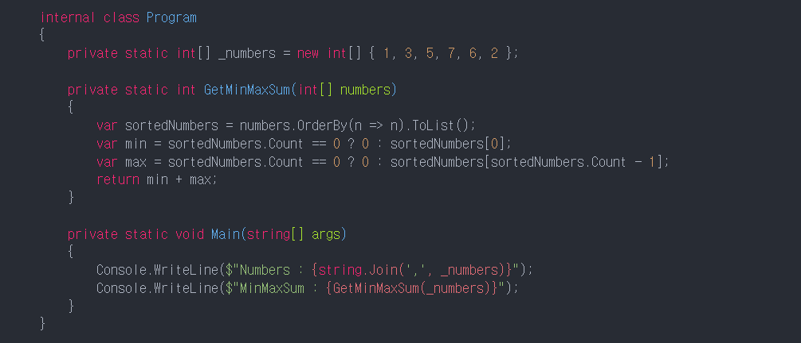
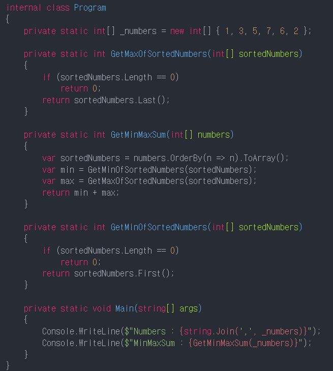
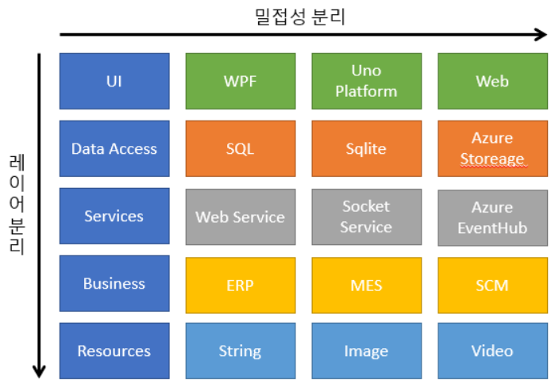
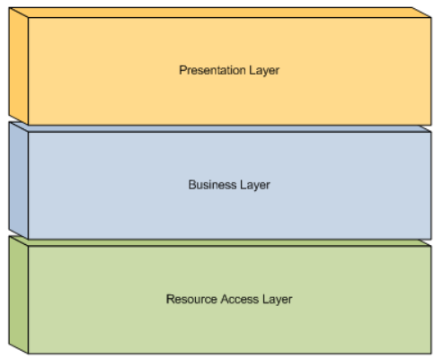
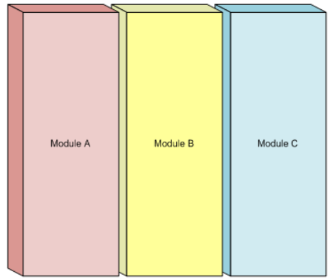
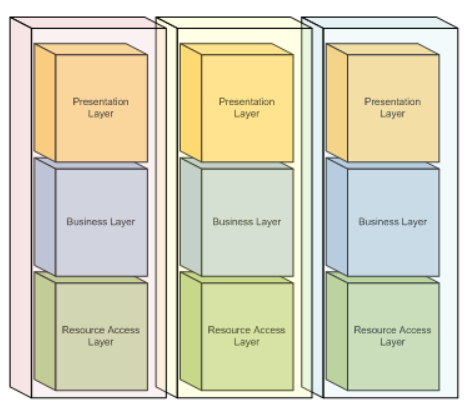
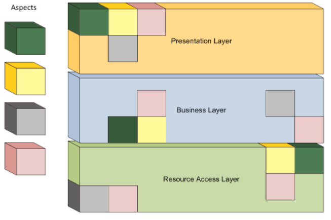

# Separation of Concerns

## 1.

### 관심사의 분리

- 관심사의 분리 (SoC)는 소프트웨어 개발에서 가장 기본적인 원칙중 중 하나이며,SOLID 원칙 5개 중 2개 (단일 책임 및 인터페이스 분리)가 이 개념에서 직접 파생될 정도로 매우 중요하다.
- 원칙은 간단하다, 프로그램을 하나의 단일 블럭으로 작성하지 말고 작은 조각으로 나누어 각각 간단한 개별 자업을 완료할 수 있도록 만드는 것이다.

### SoC for programming functions

- 가장 낮은 레벨(실제 프로그래밍 코드)에서 SoC는 긴 복잡한 함수를 쓰지 말라고 이야기하는 것이다.
- 함수의 크기가 커지기 시작하면 함수가 너무 많은 작업을 처리한 다는 것이고, 이는 함수를 분리해야 하는 신호입니다.

- 이러한 경우 SoC에서는 이를 리팩터링하여 더 간결한 모양으로 만들어야 한다. 이 프로세스 중에 원래 알고리즘의 일부가 내보내지고 개인 엑세스 수준을 가진 별도의 작은 함수로 캡슐화된다.  
  이렇게하면, 코드가 명료해지고 다른 부분에서 재사용할 수 있게 된다.

- 복잡한 코드
    - 

- SoC 리팩토링된 코드
    - 
- 조금 더 높은 수준에서 이 원칙은 각각 논리적 상관관계 가 분명한 단일 작업 세트를 만들고, 모듈 하에서 함수를 그룹화 하도록 한다.
- 이 프로세스는 우리가 함수에 대해 수행해야 했던 것과 매우 유사하다. 덜 밀접하게 관련된 기능을 분리하고 동일한 고유한 목적을 제공하는 기능들을 그룹화한다.
- 수직과 수평 모듈 분할 예시
    - 
- Cohesion and Coupling
    - SoC의 적용은 결합의 감소와 응집력의 증가라는 두 가지 과정을 포함합니다.
    - 응집력은 직무의 집합, 세부사항의 수준 및 지역별 유사성의 척도이다.  
      예를 들어, drawCircle 및 drawTriangle 함수는 도면을 담당하는 동일한 모듈에 속할 만큼 응집력이 있으며, 이 두 함수를 코드 (높은 유사성 ~높은 응집성)에 서로 가깝게 배치하는 것은
      자연스러운 것이다.
    - 반면에 커플링은 시스템의 나머지 부분에 대한 부품의 의존도를 측정하는 것이다. (저의존도 ~ 느슨한 커플링).  
      앞서 언급한 drawCircle과 drawTriangle은 또 다른 함수 drawCybertruck에 의해 사용될 수 있다. 우리는 이 기능을 드로우 모듈에 넣을 수 있지만,  
      drawCyberTruck이 물리 엔진과 외부 상태에 의존한다면, 이것으로 인해 전체 드로우 모듈의 재사용률이 낮아지고 몇 가지 다른 필수 구성요소를 가지게 될 수 있다.
    - 원시 드로잉 함수와 drawCyberTruck은 추상화 및 논리 복잡성이 다른 수준에 속하므로 서로 다른 모듈에 상주해야 한다는 것을 알 수 있다.
    - 우리가 다른 프로젝트에서 드로잉 모듈을 사용하기로 결정한다고 했을 때, 이 모듈이 물리 엔진에 의존하지 않기 때문에 더 쉽게 사용할 수 있다.
    - 구현 목표
        - Decoupling is good - loose coupling 을 목표로 해야 한다.
        - Cohesive code is good - 높은 응집력을 목표로 해야 한다.
    - 알고리즘의 논리를 작성할 때 기능이나 모듈 사이를 뛰어다니게 된다면, 이것은 코드의 응집도가 낮다는 것을 의미한다. 이것을 스파게티 코드라고 부른다.

### Benefits of the Loose Coupling and High Cohesion

- 관심사의 분리 원칙을 준수하면 코드의 다양한 특성을 개선할 수 있다.
    - 더 나은 코드 명료성 : 각 모듈이 논리적으로 범위가 지정된 일련의 메서드를 가진 간결하고 명확한 API를 가질 때 프로그램에서 어떤 일이 벌어지는지 이해하는 것이 훨씬 더 쉽습니다.
    - 코드의 재사용성 향상 (DRY 원리) : 코드를 재사용하는 주된 이점은 유지관리 비용 절감이다. 기능을 확장하거나 버그를 수정해야 할 때마다 한 곳만 수정하는 것이 덜 수고스럽다.
    - 더 나은 테스트 가능서 : 적절한 범위의 기능과 앱의 나머지 부분으로부터 격리된 독립 모듈을 테스트하는 것이 더 쉽다.  
      모듈이 어떻게 작동하는지 보기 위해 전체 환경을 파악할 필요는 없다. 인접한 실제 모듈을 더미 mock 또는 가짜 데이터 소스로 교체하기만 하면 충분하다.  
      이렇게 수정한 후 출력하여 모듈을 블랙박스로 테스트하거나 연결된 모듈 (BDD)에서 호출되는 메서드를 확인하여 화이트 박스로 테스트 할 수 있다.
    - 프로젝트 개발 및 유지보수 성능이 좋아진다. 새로운 기능이든 기존 기능이든 모듈 격리는 프로그램의 변경사항으로 영향을 받을 수 있는 영역을 범위로 지정하는데에 도움이 되며, 따라서 개발 속도가 빨라진다.
    - 여러 엔지니어의 의한 동시 개발이 더 용이하다. 서로 간섭하지 않도록 하기 위해 어떤 모듈을 진행 중인지 합의하면 된다.  
      모듈의 API 업데이트만이 다른 개발자에게 명시적으로 알리는 플래그가 될 수 있으며, 대부분의 변경사항은 다른 제공자의 즉각적인 주의 업시 추가할 수 있다.
    - 우수한 테스트 적용 범위와 결합되면 병렬 개발은 단독으로 작업하는 각 개별 엔지니어의 누적 생산성만큼 효율적이게 된다.

> 결합과 응집력은 궁극적으로 프로그래머의 관점에서 코드 작업의 편의성에 영향을 미치는 특성이다.

## 2

### SoC 관심사의 분리 (Separation Of Concerns)

- 관심사의 분리 SoC(Seperation of Concerns)란 소프트웨어 상에서 구조를 패턴, 역할, 기능 등을 각각 맞게 섹션 별로 분리해서 작성하는 것이다.  
  분리해서 작성하였을 때 주의 사항은 꼭 그 특성에 맞게 하나의 역할을 부여해서 작성을 하는 것이다. 조금 짧게 말하자면 코드 작성할 때의 SoC란 작성할 때 하나의 역할 별로 분리해서 작성하라는 것이다.  
  일상에서의 예로 들자면, 병원에서의 SoC를 봅시다. 병원에서는 한 환자가 치료 목적으로 오면 상황에 따라 다르겠지만 안내를 받고, 진료를 받고, 케어를 받은 후, 약을 받고 집에 간다고 하자.  
  안내 데스크의 사람이 안내랑 수속등을 해주고 치료는 의사가 해주고, 케어는 간호사들이 해주고, 약은 약사가 줄 것이다. 이렇게 역할이 나뉘는 것을 SoC이다.  
  그러면 코드에서 SoC의 예제를 보자. 예를 들어서 우리는 몇 개의 수들이 있는데 그것의 최대와 최소의 합을 구하고 싶다.
- SoC가 아닌 간단한 예제

```javascript
const arrayNumbers = [1, 3, 5, 7, 6, 2];
const getMinMaxSum = (arrayNumbers) => {
    sortedArray = arrayNumbers.sort();
    let min = sortedArray[0];
    let max = sortedArray[sortedArray.length];
    return min + max;
}
```  

- 여기서 보면 이 함수에서 sort를 하고 min을 구하고 max를 구하고 min max의 합을 구한다. 물론 간단한 예제라서 이렇게 대충 쓰고 짧게 해도 되겠지만, 코드가 길고 난잡하기 시작하면 뭐가 어디있는지도
  모르고 정확히 어디서부터 어디까지의 역할을 하는지 모를 수도 있으므로 우리는 저 sort랑 min 구하는거랑 max구하는걸 따로 빼서 구성하고 저 함수에서는 그것들을 불러와서 합만 하는 게 SoC작성의
  방향성이다.
- soc 예제

```javascript
const arrayNumbers = [1, 3, 5, 7, 6, 2]

const getMinofSortedArray = (sortedArray) =>{
    return sortedArray[0];
}
const getMaxofSortedArray = (sortedArray) =>{
    returnsotredArray[sortedArray.length];
}
const getMinMaxSum = (arrayNumbers) => {
    sortedArray = arrayNumbers.sort();
    let min = getMinofSortedArray(sortedArray);
    let max = getMaxofSortedArray(sortedArray); [sortedArray.lentgh];
    return min + max;
}
```  

- SoC로 구성한것이 더 길지만 더 복잡해지는 코드라면 SoC가 보기 더 쉽다.  
이제 테이블로 기본적인 코드 부분에서의 SoC의 계층을 보도록 하자.    

<Center><br><B style="color:Orange">Soc</B></BR>
Presentation </br>
Business<br>
Resource


</Center>  


- 위와 보듯이 보통 SoC 부분을 크게 화면 렌더링층(Presentation Layer), 비즈니스층(Business Layer), 리소스층(Resource Layer).  
어떻게 분할 하느냐에 따라 다르겠지만 층이 3개 이상으로 나눌 수도 있다.  
그러나 크게 3개만 봐도 무방하다.  

  화면 렌더링 부분은 말 그대로 화면 띄어 주고 ui에 관련되어 있다.  
비즈니스층은 그 ui외의 모든 논리, 계산, 객체 모델, 제어 흐름 등을 포함한다.  
리소스 부분은 외부 데이터에 접근할 하는 부분을 관리한다.   
이렇게 역할 별로 분리해서 코드들을 작성 하게 되면 많은 긍정적인 효과를 가져올 수 있다.  
예를 들자면 관리에 용이하고, 변경 및 재활용에 또한 용이하며 찾기도 쉽다.  


- 위의 나열은 수평 SoC라고하면 아래는 수직 SoC이다.

  

- 보통 동일한 기능 등을 묶어서 모듈별로 나누는 것이다.  
보통 큰 프로젝트를 이렇게 나누게 된다.  
위의 예와 엮어서 말하자면 병원을 한 모듈이라고 했을때, 다른 모듈을 정부, 회사 등이라고 하고
그 모듈들을 포함하는 것을 한 국가라고 하면 비슷하다.  

  
- 수직 Soc 안에 수평 SoC가 있다고 생각하면 편하다.  
그리고 그 수평 SoC가 크다면 그것 또한 나눠서 쓸 때도 있다.  
  
- 이렇게 큰 층들을 나눠서 보는게 ASoC (Aspect Sepration of Concerns)나 AOP(Aspect-Oriented Programming) 이라고 한다.  
그림으로 보듯이 필요한 부분만 필요한 곳에 연결해서 쓸 수 있다.  
- 결국 코딩 부분에서 SoC를 따른다 하면 우리는  
<B><span style="color:Orange">반복되는 코드의 역할을 단일화 </span><BR>
<span style="color:Yellow">재활용이 용이하게</span><BR>
<span style="color:Green">크기를 최소화하고</span><BR>
<span style="color:Red">이름을 줄 때 그 이름에 맞게 그것만 하는</span><BR>
<span style="color:Blue">외부 종속성을 최소화 하는것</span><BR></B>
들에 유의하면서 작성하도록 해야한다.  
이렇게만 한다면 SoC는 컴퓨터 프로그램의 개발 및 유지 관리를 단순화하는 데 유용하고 코드가 잘 분리되면 개별 섹션을 쉽고 독립적으로 재사용, 수정 및 디버깅할 수 있다.
그래서 SoC가 잘 구성이 되어 있다면 데이터의 의존성 방향은 지속적으로 같은 방향이다.  
  
- 오래된 게임들을 보면 버그가 많고 그것을 고쳐달라고 유저들이 아우성을 쳐도 안 고치고 놔두는 운영자들이 많다고 한다.  
물론 귀찮고 인력 낭비라 그럴 수도 있겠지만 보통 코드들이 너무 방대하게 쌓여 있어서 찾기가 어려워져 그럴 가능성이 제일 높다.  
처음부터 SoC패턴, 계층화가 제대로 되어 있따면 고치기 쉬웠을것이다.
