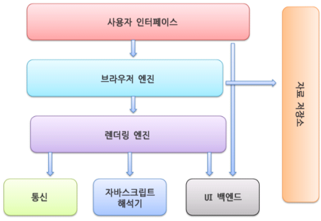

# Quest 06. 인터넷의 이해

## Introduction
* 이번 퀘스트에서는 인터넷이 어떻게 동작하며, 서버와 클라이언트, 웹 브라우저 등의 역할은 무엇인지 알아보겠습니다.

## Topics
* 서버와 클라이언트, 그리고 웹 브라우저
  * "서버"란 개념적인 용어이며, 어떤 형태의 컴퓨터든 상관 없이 정보제공의 역할을 하는 주체라면 "서버"라고 불릴 수 있다.
  * "클라이언트"란 서버에 알맞은 형태로 요청을 하고 그 결과를 사용자에게 알맞게 알맞게 전달하는 것 이라고 정의할 수 있다.
  * "브라우저"란 웹 페이지, 사진, 등등의 웹 서버의 모든 정보를 볼 수 있도록 하고, 문서 검색을 도와주는 응용 프로그램이다.  
  각 브라우저는 서로 다른 데이터 해석 방식을 갖고 있을 수 있다, 때문에 특정 웹사이트의 외관 또는 기능이 브라우저마다 다르게 표현될 수 있다.  
  브라우저는 클라이언트/서버 모델로써 클라이언트는 웹 서버에 접속하고 정보를 요청하는 컴퓨터를 운영한다. 웹서버는 해당 정보를 HTTP를 따라 웹 브라우저에 전송하며,  
  웹브라우저는 해당 결과를 표시한다. 브라우저는 서버로부터 데이터를 전송받고, 렌더링 엔진을 사용해 이를 텍스트 및 이미지 등으로 변환한다. 해당 데이터는 HTML 코드로 작성되어 있어있고,  
  브라우저는 이러한 HTML 코드를 읽고 최종 화면을 사용자에게 표시하는 역할을 한다. 마지막으로 웹 브라우저는 동기적으로 (HTML+CSS), JavaScript 언어를 해석한다.
    * 브라우저의 작동 원리
      * 웹 브라우저 작동이 동기적인 이유.
        * `script` 태그를 `body` 태그 하단에 위치시키니는 아이디어에서 찾을 수 있다.
          * `HTML` 요소들이 `script` 로딩 지연으로 인해 렌더링에 지장 받는 일이 발생하지 않아 페이지 로딩 시간이 단축된다.
          * `DOM`이 완성되기 전에  `script`가 `DOM`을 조작한다면 에러가 발생한다.
          * 자바스크립트는 렌더링 엔진이 아닌 자바스크립트 엔진이 처리한다.
      * 웹 브라우저가 웹 서버에 필요한 자원(웹페이지)을 요청하면 서버는 응답하고 웹 브라우저는 이를 해석한 후 사용자(Client)에게 보여준다. 보통 자원은 `HTML` 문서지만 `PDF`,`이미지` 등 다양한 형태일 수 있다.
      * 
        1. 사용자 인터페이스
           1. 사용자가 접근할 수 있는 영역이다. URI를 입력할 수 있는 주소 표시줄, 이전/다음 버튼, 북마크 메뉴, 새로 고침 버튼과 현재 문서의 로드를 중단할 수 있는 정지 버튼, 홈 버튼 등 요청한 페이지를 보여주는 창을 제외한 나머지 모든 부분이다.
        2. 브라우저 엔진
           1. 사용자 인터페이스와 렌더링 엔진 사이의 동작을 제어한다. Data Storage를 참조하며 로컬에 데이터를 쓰고 읽으면서 다양한 작업을 한다.
        3. 
* 인터넷을 구성하는 여러 가지 프로토콜
  * IP
  * TCP
  * HTTP
* DNS

## Resources
* [OSI 모형](https://ko.wikipedia.org/wiki/OSI_%EB%AA%A8%ED%98%95)
* [IP](https://ko.wikipedia.org/wiki/%EC%9D%B8%ED%84%B0%EB%84%B7_%ED%94%84%EB%A1%9C%ED%86%A0%EC%BD%9C)
  * [Online service Traceroute](http://ping.eu/traceroute/)
* [TCP](https://ko.wikipedia.org/wiki/%EC%A0%84%EC%86%A1_%EC%A0%9C%EC%96%B4_%ED%94%84%EB%A1%9C%ED%86%A0%EC%BD%9C)
  * [Wireshark](https://www.wireshark.org/download.html)
* [HTTP](https://ko.wikipedia.org/wiki/HTTP)
  * Chrome developer tool, Network tab
* [DNS](https://ko.wikipedia.org/wiki/%EB%8F%84%EB%A9%94%EC%9D%B8_%EB%84%A4%EC%9E%84_%EC%8B%9C%EC%8A%A4%ED%85%9C)
  * [Web-based Dig](http://networking.ringofsaturn.com/Tools/dig.php)

## Checklist
* 인터넷은 어떻게 동작하나요? Internet Protocol Suite의 레이어 모델에 입각하여 설명해 보세요.
  * 근거리에서 서로 떨어진 두 전자기기가 유선/무선으로 서로 통신하는 프로토콜은 어떻게 동작할까요?
  * 근거리에 있는 여러 대의 전자기기가 서로 통신하는 프로토콜은 어떻게 동작할까요?
  * 아주 멀리 떨어져 있는 두 전자기기가 유선/무선으로 서로 통신하는 프로토콜은 어떻게 동작할까요?
  * 두 전자기기가 신뢰성을 가지고 통신할 수 있도록 하기 위한 프로토콜은 어떻게 동작할까요?
  * HTTP는 어떻게 동작할까요?
* 우리가 브라우저의 주소 창에 www.knowre.com 을 쳤을 때, 어떤 과정을 통해 서버의 IP 주소를 알게 될까요?

## Quest
* tracert(Windows가 아닌 경우 traceroute) 명령을 통해 www.google.com 까지 가는 경로를 찾아 보세요.
  * 어떤 IP주소들이 있나요?
  * 그 IP주소들은 어디에 위치해 있나요?
* Wireshark를 통해 www.google.com 으로 요청을 날렸을 떄 어떤 TCP 패킷이 오가는지 확인해 보세요
  * TCP 패킷을 주고받는 과정은 어떻게 되나요?
  * 각각의 패킷에 어떤 정보들이 담겨 있나요?
* telnet 명령을 통해 http://www.google.com/ URL에 HTTP 요청을 날려 보세요.
  * 어떤 헤더들이 있나요?
  * 그 헤더들은 어떤 역할을 하나요?

## Advanced
* HTTP의 최신 버전인 HTTP/3는 어떤 식으로 구성되어 있을까요?
* TCP/IP 외에 전세계적인 네트워크를 구성하기 위한 다른 방식도 제안된 바 있을까요?
